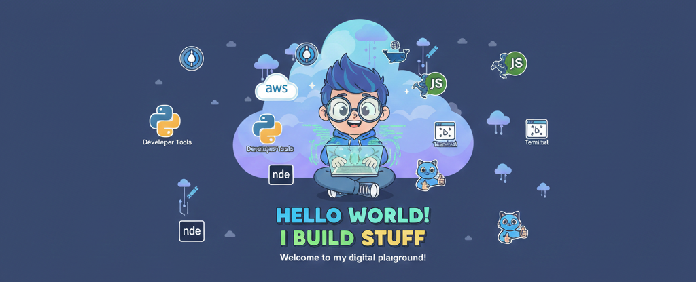

<!-- =========================
     ✨ ANIMATED HERO BANNER (Premium)
========================= -->
<!-- =========================
     FUN CUSTOM BANNER
========================= -->

  

<!-- =========================
     ✨ GLOWING ANIMATED INTRO CARD
========================= -->

  

<!-- =========================
     ✨ PROFILE VIEWS (Glass Style)
========================= -->

  

---

# 👋 About Me
I’m **Vijay Aditya R V**, a driven **Cloud & Data Engineering enthusiast** pursuing a dual academic path:

🎓 **B.Tech in CSE @ Amrita University**  
📘 **BS in Data Science @ IIT Madras**

I'm passionate about designing **cloud-ready, data-centric, scalable systems** using AWS, ML fundamentals, full-stack tools, and clean UI principles.

## 🏅 AWS Certifications

  
  

### 🌩️ AWS Cloud Practitioner (CLF-C02)
The AWS Cloud Practitioner certification validates foundational cloud knowledge, core AWS services, global infrastructure, pricing, security, and best practices.  
It demonstrates my ability to understand cloud concepts and contribute confidently to AWS-based projects.

### 🤖 AWS AI Practitioner (AIF-C01)
The AWS AI Practitioner certification showcases my understanding of Generative AI, responsible AI, foundation models, and AWS AI/ML services like SageMaker and Bedrock.  
It proves my readiness to design or support AI-driven solutions using AWS technologies.

---

# 🚀 Quick Highlights

  
  
  
  

---
# 🛠️ Tech Stack  
*(Static icons — clean, complete, recruiter-friendly)*

### 🧩 Languages & Databases  

  

## 🛠 Tech Stack & Skills

### ☁️ Cloud & Platforms

---

### 📊 Data Science & Analytics

---

### 🤖 Machine Learning & AI

---

### 🌐 Full Stack Development

---

### 🗄️ Databases & Storage

---

### 🔌 Embedded Systems & Low-Level

---

### 🖥️ OS, Terminal & Scripting

---

### ⚙️ Developer Tools & Workflow

---

### 🧠 Core Engineering Skills
✔ Data Analysis & Visualization  
✔ Machine Learning Fundamentals  
✔ REST API Design  
✔ System & Logical Thinking  
✔ Debugging & Optimization  
✔ Problem Solving (DSA)  
✔ Hands-on Project Building  

## 🧠 LeetCode Stats

  

---

# 🎭 Fun Side  
- 🎬 Skilled video editor with love for cinematic transitions  
- ⚡ Thrives in fast-paced learning environments  
- 💡 Builds products that feel meaningful and user-friendly  
- 😂 Debugging > Meditation — teaches patience  

---

# 🤝 Connect With Me  

  
  

---

